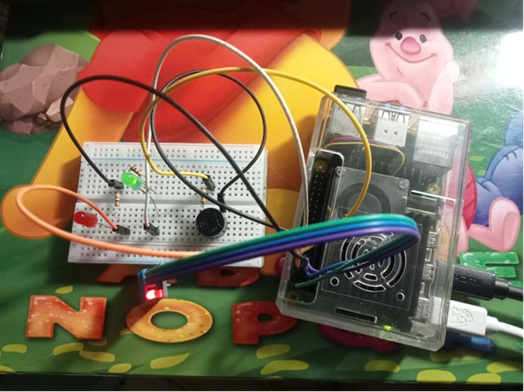
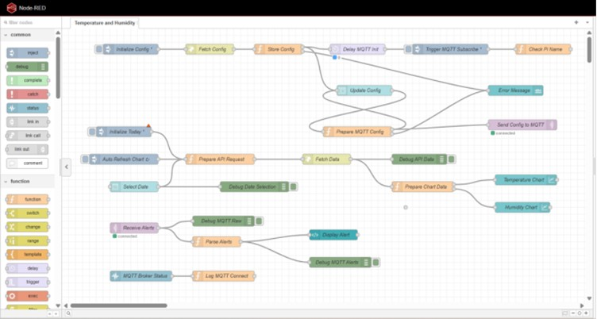
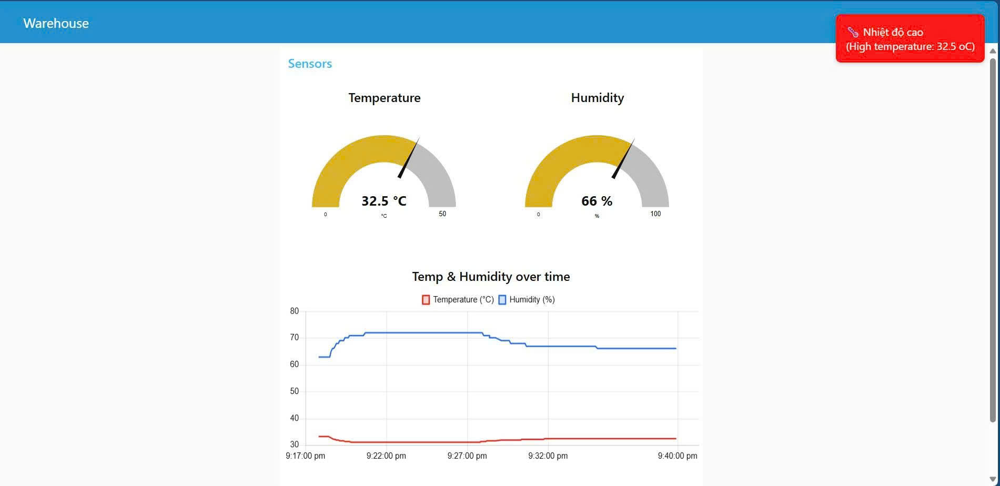
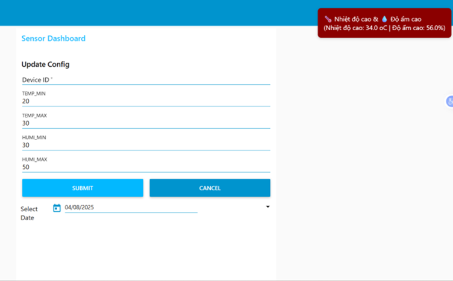

# Warehouse Environment Monitoring System with Raspberry Pi

A comprehensive real-time temperature and humidity monitoring system for warehouses using Raspberry Pi, Node-RED dashboard, and MQTT communication. The system includes sensor data collection, alert management, data logging, and a web-based dashboard for monitoring and control.

## Features

- **Real-time Monitoring**: Continuous temperature and humidity monitoring using DHT22 sensor
- **Local Data Storage**: CSV-based data logging with configurable intervals
- **Node-RED Server**: Web server built with Node-RED for data access and API
- **Web Dashboard**: Beautiful web-based dashboard with gauges and alerts
- **Alert System**: Configurable alerts for temperature and humidity thresholds
- **Data Visualization**: Historical data charts and real-time displays
- **Multi-zone Support**: Extensible architecture for monitoring multiple warehouse zones
- **Buzzer Alerts**: Physical alert system with manual control
- **Configurable Thresholds**: Easy-to-modify alert thresholds via web interface

## System Architecture

```
┌─────────────────┐    ┌─────────────────┐    ┌─────────────────┐
│   Raspberry Pi  │    │   Local Storage │    │   Node-RED      │
│   + DHT22       │──> │   (CSV Files)   │──> │   Server        │
│   + Buzzer      │    │                 │    │                 │
└─────────────────┘    └─────────────────┘    └─────────────────┘
         │                       │                       │
         ▼                       ▼                       ▼
┌─────────────────┐    ┌─────────────────┐    ┌─────────────────┐
│   Data Logger   │    │   File System   │    │   Web Dashboard │
│   (Python)      │    │   (Local CSV)   │    │   (Node-RED UI) │
└─────────────────┘    └─────────────────┘    └─────────────────┘
```

## Project Structure

```
Warehouse-Environment-Monitoring-System-with-Raspberry-Pi/
├── README.md
└── Warehouse monitoring/
    ├── assets/
    │   └── Dashboard.jpg                      # Dashboard screenshot
    |   └── kit.jpg                            # Hardware connect
    |   └── node_red_flow.jpg                  # Node-red Flow screenshot
    |   └── Temp_humid_config.jpg              # Configuration screenshot
    ├── config/
    │   └── setting.json               # Configuration settings
    ├── dashboard node-red/
    │   └── dht.json                   # Node-RED flow export
    ├── raspberry-pi/
    │   ├── warehouse_sensors.py       # Main sensor script
    │   └── requirements.txt           # Python dependencies
    └── sever/
    |    └── sever.js                   # Express.js web server
    └── logs/
        └── sensor_data.csv            # Local CSV data storage   
```

## Technologies Used

### Hardware
- **Raspberry Pi** (tested on Raspberry Pi 5)
- **DHT22 Sensor** for temperature and humidity
- **Buzzer** for audio alerts
- **LED** for visual indicators

### Software
- **Python 3** - Sensor data collection and MQTT publishing
- **Node.js/Express.js** - Web server and API
- **Node-RED** - Dashboard and flow management
- **CSV** - Data logging and storage

### Key Libraries
- `Adafruit-DHT` - DHT sensor library
- `gpiozero` - GPIO control for Raspberry Pi
- `csv` - Python CSV data logging
- `Node-RED HTTP nodes` - Web server and API endpoints
- `Node-RED Dashboard nodes` - Web interface components

## Quick Start

### Prerequisites

1. **Raspberry Pi** with Raspberry Pi OS
2. **DHT22 Sensor** connected to GPIO4
3. **Buzzer** connected to GPIO22 (optional)
4. **LED** connected to GPIO17 (optional)
5. **Internet connection** 

### Installation

#### 1. Clone the Repository
```bash
git clone https://github.com/yourusername/Warehouse-Environment-Monitoring-System-with-Raspberry-Pi.git
cd Warehouse-Environment-Monitoring-System-with-Raspberry-Pi
```

#### 2. Install Python Dependencies
```bash
cd "Warehouse monitoring/raspberry-pi"
pip3 install -r requirements.txt
```
- If you are using virtual enviroment remember to activate it
```bash
python3 -m venv venv
source venv/bin/activate
pip install -r requirements.txt
```
#### 3. Install Node-RED Dashboard Nodes
```bash
cd "Warehouse monitoring"
npm install -g node-red-dashboard
```
#### 4. Install Node-RED
```bash
bash <(curl -sL https://raw.githubusercontent.com/node-red/linux-installers/master/deb/update-nodejs-and-nodered)
```

### Configuration

#### 1. Update Configuration Settings
Edit `Warehouse monitoring/config/setting.json`:

```json
{
    "READ_INTERVAL_SEC": 5,
    "TEMP_MAX": 30.0,
    "TEMP_HYST": 0.5,
    "HUMI_MIN": 40.0,
    "HUMI_MAX": 70.0,
    "ALERT_INTERVAL_SEC": 10,
    "CSV_FILE_PATH": "logs/sensor_data.csv",
    "LOG_INTERVAL": 5,
    "LOG_DIR": "logs"
}
```

#### 2. Hardware Connections

| Component | GPIO Pin | Description |
|-----------|----------|-------------|
| DHT22 VCC | 3.3V | Power supply |
| DHT22 GND | GND | Ground |
| DHT22 DATA | GPIO4 | Data pin |
| Buzzer + | GPIO22 | Audio alerts |
| LED + | GPIO17 | Visual alerts |

### Running the System

#### 1. Start the Sensor Script
```bash
cd "Warehouse monitoring/raspberry-pi"
python3 warehouse_sensors.py
```

#### 2. Start Node-RED Server
```bash
node-red-start
```

#### 3. Import Node-RED Flow
1. Open Node-RED: `http://your-pi-ip:1880`
2. Import the flow from `Warehouse monitoring/dashboard node-red/dht.json`
3. Deploy the flow
4. Access dashboard: `http://your-pi-ip:1880/ui`

## Dashboard Features

### Real-time Monitoring
- **Temperature Gauge**: Real-time temperature display in °C
- **Humidity Gauge**: Real-time humidity display in %
- **Status Indicators**: Visual status for sensor connectivity

### Alert System
- **Color-coded Alerts**:
  - 🔴 Red: High temperature (>30°C)
  - 🔵 Blue: High humidity (>70%)
  - 🔵 Light Blue: Low temperature (<20°C)
- **Popup Notifications**: Instant alert popups
- **Buzzer Control**: Manual buzzer on/off button

### Data Management
- **Historical Data**: View past sensor readings
- **Export Functionality**: Download data as CSV
- **Configuration Panel**: Modify alert thresholds

## API Endpoints

### Data Access (Node-RED HTTP Nodes)
- `GET /api/data` - Get latest sensor readings from CSV
- `GET /api/history` - Get historical data from CSV files
- `GET /api/config` - Retrieve current configuration
- `POST /api/config` - Update configuration settings

### Example API Usage
```bash
# Get current sensor data
curl http://your-pi-ip:1880/api/data

# Get historical data
curl http://your-pi-ip:1880/api/history

# Update temperature threshold
curl -X POST http://your-pi-ip:1880/api/config \
  -H "Content-Type: application/json" \
  -d '{"TEMP_MAX": 35.0}'
```

### Message Format
```json
{
  "temperature": 25.6,
  "humidity": 65.2,
  "timestamp": "2024-01-15T10:30:00Z",
  "sensor_id": "dht22_01"
}
```

## Data Storage

### CSV File Structure
The system stores sensor data in CSV format with the following structure:

```csv
timestamp,temperature,humidity,alert_status
2025-08-03T10:30:00Z,25.6,65.2,normal
2025-08-03T10:30:05Z,26.1,64.8,high_temp
```

### File Locations
- **Sensor Data**: `logs/sensor_data.csv`
- **Configuration**: `config/setting.json`
- **Logs**: `logs/` directory

## Troubleshooting

### Common Issues

1. **Sensor Not Reading**
   - Check GPIO connections
   - Verify DHT22 is properly powered
   - Ensure correct GPIO pin configuration

2. **Dashboard Not Loading**
   - Ensure Node-RED is running
   - Check port 1880 is accessible
   - Verify flow is deployed

3. **CSV File Not Created**
   - Check file permissions in logs directory
   - Verify Python script has write access
   - Ensure logs directory exists

4. **Node-RED Server Issues**
   - Check Node-RED installation
   - Verify dashboard nodes are installed
   - Check Node-RED logs for errors

### Debug Mode
Enable debug logging by setting environment variable:
```bash
export DEBUG=true
python3 warehouse_sensors.py
```

## Future Enhancements

- [ ] **Database Integration**: PostgreSQL or SQLite for better data management
- [ ] **Email/SMS Alerts**: Notification system via Node-RED
- [ ] **Mobile App**: React Native dashboard
- [ ] **Machine Learning**: Predictive maintenance using historical data
- [ ] **Multi-sensor Support**: Multiple DHT22 sensors
- [ ] **Energy Monitoring**: Power consumption tracking
- [ ] **Security Features**: Authentication and encryption
- [ ] **Data Backup**: Automated CSV backup to cloud storage
- [ ] **Real-time Charts**: Advanced visualization with Chart.js

## Contributing

1. Fork the repository
2. Create a feature branch (`git checkout -b feature/amazing-feature`)
3. Commit your changes (`git commit -m 'Add amazing feature'`)
4. Push to the branch (`git push origin feature/amazing-feature`)
5. Open a Pull Request

## License

This project is licensed under the MIT License - see the [LICENSE](LICENSE) file for details.

## Acknowledgments

- **Adafruit** for the DHT sensor library
- **Node-RED** community for the excellent dashboard framework
- **Raspberry Pi Foundation** for the amazing hardware platform

## Support

For support and questions:
- Create an issue on GitHub
- Check the troubleshooting section
- Review the configuration documentation

### Screenshots



